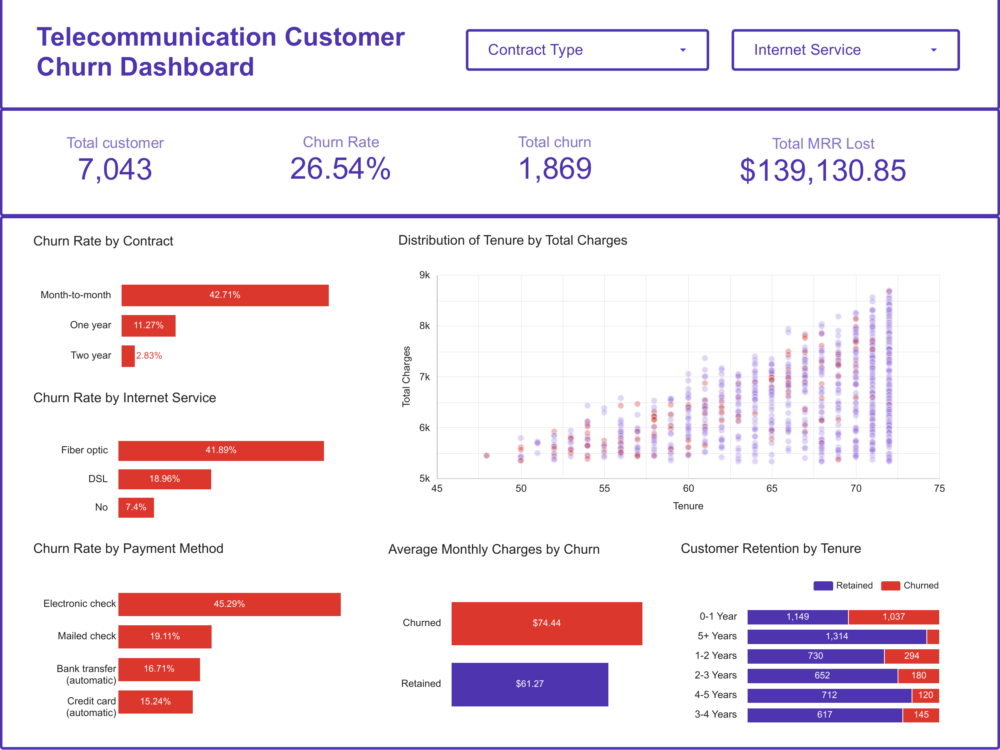

# Telco Customer Churn Analysis

**End-to-end data analytics project:** Kaggle → BigQuery (SQL) → Looker Studio

Which customers leave a telecom company, how much monthly revenue does that cost, and where should a retention team focus first? This project cleans the IBM Telco churn dataset in Google BigQuery, measures churn across customer segments with SQL, and presents the results in an interactive Looker Studio dashboard.

[**View the live dashboard**](https://datastudio.google.com/s/gDOgkuePaIE)



---

## Key Results

| Metric | Value |
|---|---|
| Total customers | 7,043 |
| Churned customers | 1,869 |
| **Churn rate** | **26.54%** |
| **Monthly recurring revenue (MRR) lost** | **$139,130.85** |

> MRR lost = the sum of `MonthlyCharges` for customers who churned. It is the *monthly* revenue those customers were paying, not their lifetime value.

## Insights

**1. Contract type is the strongest churn signal.**
Month-to-month customers churn at **42.71%**, versus **11.27%** on one-year and **2.83%** on two-year contracts. That is roughly 15x higher than the two-year group.

**2. The first year is the danger zone.**
Customers in their first 12 months churn at about **47%** (1,037 of 2,186), and they account for **55%** of all churned customers. Churn falls steadily with tenure, to about **6.6%** for customers with 5+ years.

**3. Fiber optic customers churn far more than other internet groups.**
Fiber optic: **41.89%**, DSL: **18.96%**, no internet: **7.40%**.

**4. Payment method matters.**
Electronic check customers churn at **45.29%**, compared with **15.24%** for credit card (automatic) and **16.71%** for bank transfer (automatic).

**5. Churners pay more.**
Churned customers pay an average of **$74.44** per month versus **$61.27** for retained customers (about 21% higher), so churn hits revenue harder than the customer count suggests.

### Retention by tenure

| Tenure group | Retained | Churned | Churn rate |
|---|---|---|---|
| 0-1 Year | 1,149 | 1,037 | 47.4% |
| 1-2 Years | 730 | 294 | 28.7% |
| 2-3 Years | 652 | 180 | 21.6% |
| 3-4 Years | 617 | 145 | 19.0% |
| 4-5 Years | 712 | 120 | 14.4% |
| 5+ Years | 1,314 | 93 | 6.6% |

## Recommendations

These are hypotheses suggested by the patterns above. This analysis is descriptive, so it shows association, not proof of cause.

1. **Move month-to-month customers onto longer contracts** with discounts or perks, prioritizing those in their first year.
2. **Strengthen onboarding for new customers.** A check-in program in months 1 to 12 targets the segment where over half of churn happens.
3. **Investigate the fiber optic experience.** Check service quality, pricing and support issues, since fiber customers also pay higher monthly charges.
4. **Encourage automatic payments.** Offer incentives to switch from electronic check to card or bank auto-pay.

## Tech Stack

| Layer | Tool |
|---|---|
| Data source | Kaggle: [Telco Customer Churn](https://www.kaggle.com/datasets/blastchar/telco-customer-churn) (IBM sample data) |
| Storage & analysis | Google BigQuery (Standard SQL) |
| Visualization | Looker Studio |


## Repository Structure

```
telco-churn-analysis/
├── README.md
├── LICENSE
├── .gitignore
├── sql/
│   ├── 01_data_cleaning.sql     # Quality checks, type casting, typed table
│   ├── 02_eda_metrics.sql       # Churn %, MRR lost, segment breakdowns
│   └── 03_dashboard_view.sql    # View that feeds Looker Studio
├── docs/
│   ├── data_dictionary.md       # Column definitions and cleaning notes
│   ├── architecture.md          # Pipeline diagram (Mermaid)
│   └── architecture.png         # Pipeline diagram (image)
└── assets/
    └── dashboard_preview.png    # Dashboard screenshot
```

## Methodology

1. **Load** the Kaggle CSV into BigQuery as the raw table.
2. **Validate** ([`01_data_cleaning.sql`](sql/01_data_cleaning.sql)): duplicate check on `customerID` and a null profile across all 21 columns.
3. **Clean and type** the data:
   - Yes/No columns become 1/0 flags.
   - `TotalCharges` arrives as text with blanks for customers with `tenure = 0`; these are set to 0 (nothing billed yet) and the rest are cast to `FLOAT64`.
4. **Analyze** ([`02_eda_metrics.sql`](sql/02_eda_metrics.sql)): overall churn rate, MRR lost, and churn by contract, internet service, payment method and tenure group.
5. **Publish** ([`03_dashboard_view.sql`](sql/03_dashboard_view.sql)): a BigQuery view connected to Looker Studio.

### Dashboard calculated fields

| Field | Definition |
|---|---|
| Churn status | `CASE WHEN churn_flag = 1 THEN 'Churned' WHEN churn_flag = 0 THEN 'Retained' ELSE 'Unknown' END` |
| Tenure year group | 12-month buckets of `tenure` (0-1 Year ... 5+ Years) |
| Churn rate | `AVG(churn_flag)` |
| Total revenue lost | `SUM(CASE WHEN churn_flag = 1 THEN MonthlyCharges ELSE 0 END)` |

The dashboard includes KPI scorecards, horizontal bar charts (churn rate by contract, internet service and payment method), a stacked bar chart (retention by tenure), a scatter plot (tenure vs total charges) and dropdown filters for contract type and internet service.

## How to Reproduce

1. Download the CSV from [Kaggle](https://www.kaggle.com/datasets/blastchar/telco-customer-churn).
2. Create a BigQuery dataset and load the CSV as a table (auto-detect schema).
3. Update the project and dataset names in the SQL files to your own.
4. Run `sql/01_data_cleaning.sql`, then `02_eda_metrics.sql`, then `03_dashboard_view.sql`.
5. In Looker Studio, connect to the view and recreate the calculated fields above.

## Limitations & Next Steps

- The data is a single snapshot, so trends over time and true cause-and-effect can't be measured.
- MRR lost reflects monthly revenue only; a lifetime value estimate would show the full cost of churn.
- Next steps: statistical testing of segment differences, a churn prediction model (for example logistic regression or gradient boosting), and customer risk scoring.

## Author

**Wan Alif** · [GitHub @wanaalif](https://github.com/wanaalif)

## License

Released under the [MIT License](LICENSE). The dataset belongs to its original publisher (IBM sample data via Kaggle); please check the Kaggle page for its terms.
