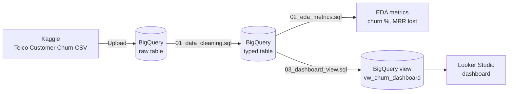

# Pipeline Architecture

```mermaid
flowchart LR
    A[Kaggle<br/>Telco Customer Churn CSV] -->|Upload| B[(BigQuery<br/>raw table)]
    B -->|01_data_cleaning.sql| C[(BigQuery<br/>typed table)]
    C -->|02_eda_metrics.sql| D[EDA metrics<br/>churn %, MRR lost]
    C -->|03_dashboard_view.sql| E[(BigQuery view<br/>vw_churn_dashboard)]
    E --> F[Looker Studio<br/>dashboard]
```

`architecture.png` in this folder is the same pipeline as an image for the README.
